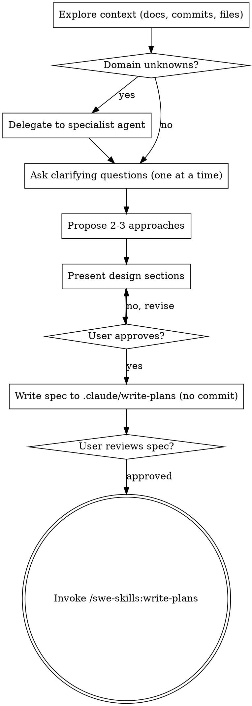

# Brainstorming Ideas Into Designs

Turn ideas into a fully-formed design through collaborative dialogue, grounded in the project's
real architecture and available agents — then hand off to `/swe-skills:write-plans`.

<HARD-GATE>
Do NOT write code, scaffold, or take any implementation action until you have presented a
design and the user has approved it. This holds for EVERY task regardless of perceived
simplicity. (Same discipline: ask before assuming — never guess to fill a gap.)
</HARD-GATE>

## Anti-pattern: "too simple to need a design"

"Simple" tasks are where unexamined assumptions waste the most work — and a wrong assumption can
touch **security, data integrity, a money path, or concurrency/ordering**. The design can be
three sentences for a truly small change, but you MUST present it and get approval.

## Checklist (create a TodoWrite item per step)

1. **Explore project context** — read the project's docs index/overview FIRST if it has one,
   then the relevant docs summaries, recent commits, and the actual files in scope.
2. **Resolve domain unknowns via specialists, never by guessing** — if the idea touches a
   subsystem with an expert agent, delegate the open questions to it (see the table below).
3. **Ask clarifying questions** — one at a time (`AskUserQuestion`), multiple-choice when
   possible. Focus on purpose, constraints, success criteria.
4. **Propose 2-3 approaches** — with trade-offs and your recommendation, grounded in existing
   repo patterns (reuse > reinvent) and blast radius.
5. **Present the design** — in sections scaled to complexity; get approval after each.
6. **Write the design doc** — save to `.claude/write-plans/YYYY-MM-DD-<topic>-design.md`. Do NOT
   commit (the user commits; never auto-commit).
7. **Spec self-review** — scan for placeholders, contradictions, ambiguity, scope.
8. **User reviews the written spec** — wait for approval.
9. **Transition to implementation** — invoke `/swe-skills:write-plans`. That is the only next
   step.

## Process flow

**Terminal state = invoking `/swe-skills:write-plans`.** Don't jump to implementation;
`/swe-skills:write-plans` turns the approved design into bite-sized, executable tasks.

## Resolve domain unknowns with the right specialist

When a design question lives in a subsystem you don't fully hold in context, delegate it to a
specialist agent (clean context, knows the subsystem) instead of guessing:

| If the idea touches… | Delegate the open question to |
|----------------------|-------------------------------|
| Async perf, connection pools, concurrency ceilings | `async-performance-guardian` |
| Blast radius across 3+ subsystems | `impact-analyzer` |
| Any subsystem with a dedicated expert (database, queue, frontend, LLM, payments, external API, …) | a matching `<domain>-specialist` agent **if the host project defines one**; otherwise native `general-purpose` / `Explore` |

## The process

**Understanding the idea:**
- Check the current state first (docs → commits → files). If a system isn't documented, say so
  explicitly and read the code before designing.
- If the request is actually several independent subsystems, flag it and decompose into
  sub-projects before refining details. Each sub-project gets its own design →
  `/swe-skills:write-plans` cycle.
- Ask one question per message. Prefer multiple choice. Focus on purpose, constraints, success
  criteria.

**Exploring approaches:**
- Propose 2-3 options, lead with your recommendation and why.
- Ground them in repo reality: **reuse existing patterns before inventing**, check the **blast
  radius** (who consumes this), respect **tenant / data isolation**, and if it touches money or
  any critical path treat it with extra rigor (idempotency, atomicity).

**Presenting the design:**
- Once you understand it, present it. Scale each section to complexity (a few sentences up to
  ~250 words). Ask after each section if it looks right.
- Cover: architecture, components, data flow, error handling, and how it's verified.

**Design for isolation and clarity:**
- Break the system into small units with one clear purpose and well-defined interfaces. For
  each: what does it do, how is it used, what does it depend on?
- Smaller, focused files beat large ones — you reason better about what fits in context, and it
  matches a simplicity doctrine (no abstraction without multiple real consumers today; YAGNI).

**Working in this codebase:**
- Follow existing patterns; mimic neighboring files. Reuse before creating.
- Fix problems that affect the work in scope; don't propose unrelated refactoring.

## After the design

- Write the validated spec to `.claude/write-plans/YYYY-MM-DD-<topic>-design.md`. **Do NOT commit.**
- Self-review the spec: kill placeholders (TBD/TODO), contradictions, ambiguity; confirm it's
  one cohesive scope (or decompose).
- Ask the user to review the written spec; make requested changes; only then proceed.
- Invoke `/swe-skills:write-plans` to create the implementation plan. Do not invoke anything else.

## Key principles

- **One question at a time** — don't overwhelm.
- **Multiple choice preferred** — easier to answer (`AskUserQuestion`).
- **YAGNI ruthlessly** — strip features the design doesn't need today.
- **Explore alternatives** — always 2-3 approaches before settling.
- **Incremental validation** — approval after each section.

## Visual companion (optional)

If your environment has a browser-automation tool (for showing mockups/layouts) or a diagramming
tool available, offer a visual ONLY when the question is genuinely visual (a layout comparison,
an architecture flow) — not for conceptual/tradeoff questions, which stay in the terminal. The
test: would the user understand this better by seeing it than by reading it?
