# Test-Driven Development

## Overview

Write the test first. Watch it fail. Write minimal code to pass.

**Core principle:** if you didn't watch the test fail, you don't know if it tests the right
thing. **Violating the letter of the rule is violating the spirit of the rule.**

## What "failing first" really buys you (read this first)

The discipline is about *watching the test fail for the right reason*, independent of whether
the test is a shipped artifact. Two realities shape how you apply it:

1. **Some projects treat certain tests as throwaway scaffolding** (uncommitted, gitignored,
   or a scratch harness). If yours does, the TDD test still drives your RED→GREEN cycle —
   it just isn't shipped. Treat it the way `regression-safety-net` treats characterization
   tests: valuable while you work, discarded after. By default, though, TDD tests are
   committed alongside the code they prove.
2. **A live dev server may run stale code** (no hot-reload, a cached build). A test that
   hits the running server can exercise the OLD code while your unit test sees the new code
   fine. **Prefer in-process tests** that import the module under test directly.

### Which testing skill is this? (don't pick the wrong one)

| Situation | Skill |
|-----------|-------|
| New feature / new bugfix, test drives the design | **this skill (TDD)** — test first |
| About to refactor/debug EXISTING working code, want a safety net | `regression-safety-net` — characterize current behavior first |
| Need a broad, adversarial production-grade suite for a finished feature | a dedicated exhaustive-testing pass |

## The Iron Law

```
NO PRODUCTION CODE WITHOUT A FAILING TEST FIRST
```

Wrote code before the test? Delete it. Start over. Implement fresh from the test.

**No exceptions:** don't keep it as "reference", don't "adapt" it while writing the test,
don't look at it. Delete means delete.

## Red-Green-Refactor

```dot
digraph tdd_cycle {
    rankdir=LR;
    red [label="RED\nWrite failing test", shape=box, style=filled, fillcolor="#ffcccc"];
    verify_red [label="Watch it fail\ncorrectly", shape=diamond];
    green [label="GREEN\nMinimal code", shape=box, style=filled, fillcolor="#ccffcc"];
    verify_green [label="Watch it pass\nall green", shape=diamond];
    refactor [label="REFACTOR\nclean up", shape=box, style=filled, fillcolor="#ccccff"];

    red -> verify_red;
    verify_red -> green [label="fails for the right reason"];
    verify_red -> red [label="wrong failure"];
    green -> verify_green;
    verify_green -> refactor [label="green"];
    refactor -> verify_green [label="stay green"];
}
```



### RED — write one minimal failing test

One behavior, clear name, real code (mocks only if unavoidable).

```python
# Retry a transient failure 3 times before giving up, because the upstream
# dependency can return transient 429s.
import pytest
from myapp.retry import retry_operation

@pytest.mark.asyncio
async def test_retries_failed_operation_three_times():
    attempts = 0
    async def op():
        nonlocal attempts
        attempts += 1
        if attempts < 3:
            raise TransientError("429")
        return "ok"

    result = await retry_operation(op)
    assert result == "ok"
    assert attempts == 3
```

### Verify RED — watch it fail (MANDATORY)

Run the test with your project's test runner. Confirm it FAILS (not errors), and fails
because the feature is missing — not a typo/import error. Test passes already? You're
testing existing behavior — fix the test.

For typed languages, the typecheck is part of the loop: run the project's typecheck plus its
test command, and watch the new test fail before implementing.

### GREEN — minimal code

Just enough to pass. No options bag "for flexibility", no extra branches (YAGNI — the most
common failure mode is over-engineering).

### Verify GREEN — watch it pass (MANDATORY)

Run the test again. Test passes, other tests still pass, output pristine. Test fails? Fix
the code, not the test.

### REFACTOR — clean up on green only

Remove duplication, improve names, extract helpers. Keep tests green. Don't add behavior.

## Good tests

| Quality | Good | Bad |
|---------|------|-----|
| **Minimal** | one behavior; "and" in the name? split it | `test_validates_email_and_domain_and_whitespace` |
| **Clear** | name describes behavior | `test_1` |
| **Real** | exercises real code (real inputs, real adapters) | asserts on a mock's call count |

> Mocking pitfalls (testing the mock instead of real behavior, test-only methods in prod code) → see `testing-anti-patterns.md` in this dir.

## Why order matters

Tests written AFTER code pass immediately — and passing immediately proves nothing (it might
test the wrong thing, the implementation instead of behavior, or miss the edge case you
forgot). Test-first forces you to see it fail, proving it tests something. This is also why
`regression-safety-net` captures behavior BEFORE you touch existing code — same logic.

## Common rationalizations

| Excuse | Reality |
|--------|---------|
| "Too simple to test" | Simple code breaks. The test takes 30 seconds. |
| "I'll test after" | Tests passing immediately prove nothing. |
| "Tests are throwaway here, so why bother" | The test is scaffolding for YOUR cycle — it proves the code, then you discard it. The point is watching it fail, not shipping it. |
| "Already manually tested" | Ad-hoc != systematic; no record, can't re-run. |
| "Deleting X hours is wasteful" | Sunk cost. Unverified code is the waste. |
| "TDD is dogmatic, I'm pragmatic" | TDD is faster than debugging in prod. |

## Red flags — STOP and start over

- Code before test · test after implementation · test passes immediately
- Can't explain why the test failed · "I'll add tests later" · "just this once"
- "It's about spirit not ritual" · "this is different because…"

## When stuck

| Problem | Solution |
|---------|----------|
| Don't know how to test | Write the wished-for API in the test first. Ask the user. |
| Test too complicated | The design is too complicated. Simplify the interface. |
| Must mock everything | Code too coupled. Use dependency injection. |
| Touches money / payments / critical financial logic | This is high-stakes code — never ship a green you can't explain; pair with a domain specialist if one is available. |

## Bug fixes

Found a bug? Write the failing test that reproduces it FIRST, watch it fail, then fix. The
test proves the fix and documents the bug — even if it lives only in a local scratch suite.

## The bottom line

```
Production code → a test existed and failed first
Otherwise → not TDD
```

Where the test is local scaffolding rather than a committed artifact, the discipline is
identical: no production code without a failing test first. No exceptions without the user's
permission — and don't `git commit`/`push` just to "save" a green cycle; end on green, and
let committing be a separate, deliberate step.
